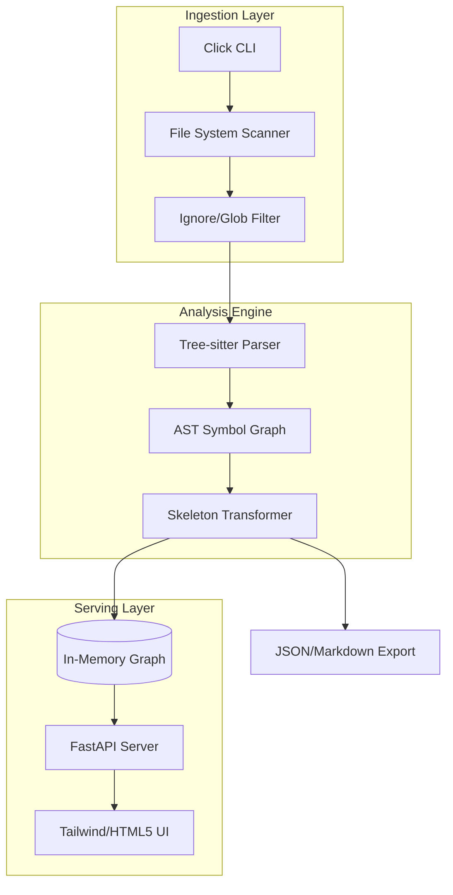

# ARCHITECTURE.md: ContextLens

## 1. High-Level System Topology
ContextLens operates as a headless static analysis engine that transforms complex, multi-file codebases into high-fidelity, token-efficient structural representations (Skeletons).



## 2. Tech Stack Rationale
*   **Python 3.11+**: Utilizes `typing.Self`, `StrEnum`, and improved `asyncio` performance for high-concurrency file I/O.
*   **Tree-sitter**: Chosen over `ast` module for language-agnostic support and incremental parsing capabilities. Provides robust error recovery for non-compilable code.
*   **FastAPI**: Asynchronous-native, high-performance serialization via `pydantic` v2, essential for serving large symbol graphs to the dashboard.
*   **Tailwind/HTML5**: Zero-dependency frontend architecture. Uses `htmx` for partial DOM updates, ensuring the dashboard remains lightweight without a heavy JS build pipeline.
*   **Pydantic v2**: Enforces strict schema validation for the serialized symbol graph, ensuring downstream LLM consumption remains deterministic.

## 3. Module & Directory Layout
```text
contextlens/
├── cli/                # Click command definitions
├── core/
│   ├── parser.py       # Tree-sitter abstraction layer
│   ├── transformer.py  # AST-to-Skeleton logic
│   └── graph.py        # Symbol relationship mapping
├── api/
│   ├── routes.py       # FastAPI endpoints
│   └── schemas.py      # Pydantic models for graph nodes
├── dashboard/
│   ├── templates/      # Jinja2 HTML5 templates
│   └── static/         # Tailwind CSS & HTMX assets
├── utils/
│   └── ignore.py       # .gitignore/glob parsing logic
└── main.py             # Application entry point
```

## 4. Data Flow & Component Interaction
1.  **Discovery**: The `CLI` module initializes a `Scanner` that respects `.gitignore` patterns.
2.  **Parsing**: Files are passed to `Tree-sitter`. The `Parser` generates a concrete syntax tree (CST).
3.  **Transformation**: The `Transformer` traverses the CST, pruning function/method bodies. It extracts:
    *   `Signature`: Name, parameters, return types.
    *   `Docstrings`: Preserved for context.
    *   `Imports`: Mapped to identify cross-file dependencies.
4.  **Graph Construction**: Nodes (Symbols) and Edges (References/Imports) are stored in a directed acyclic graph (DAG) structure.
5.  **Serialization**: The `API` serializes the DAG into a compact JSON schema optimized for LLM context windows.
6.  **Visualization**: The `Dashboard` consumes the JSON, rendering a navigable tree view via Tailwind-styled components.

## 5. Security & Boundary Isolation
*   **Read-Only Execution**: The engine operates strictly in read-only mode. No file system mutations are permitted.
*   **Symbol Sanitization**: The `Transformer` implements a strict allow-list for symbols. Sensitive data (e.g., hardcoded credentials, API keys) is stripped via regex-based pattern matching during the transformation phase.
*   **Memory Constraints**: The `Graph` store implements a TTL-based cache for large repositories to prevent OOM (Out-of-Memory) errors on massive codebases.
*   **Path Traversal Prevention**: The `Scanner` enforces absolute path resolution and validates that all accessed files reside within the defined project root, preventing unauthorized file system access.
*   **Dependency Pinning**: All third-party dependencies (Tree-sitter bindings, FastAPI) are pinned with hashes in `requirements.txt` to mitigate supply-chain attacks.