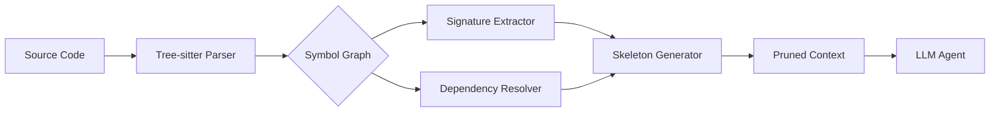

# ContextLens

**Semantic & AST Context Pruner for LLM Coding Agents**


---

### The Problem: Context Bloat
Modern coding agents often consume entire repositories, leading to "context rot." Passing full dependency files into LLM prompts results in:
* **Token Exhaustion:** 80%+ of tokens are wasted on implementation details irrelevant to the agent's current task.
* **Attention Dilution:** High-noise prompts degrade the model's ability to focus on critical logic, leading to hallucinations.
* **Latency & Cost:** Increased input token counts drive up inference costs and latency linearly.

### The Solution: Semantic Pruning
ContextLens parses source code into syntactic symbol graphs. It strips redundant function bodies while preserving signatures, docstrings, type annotations, and import hierarchies, returning a lightweight "structural skeleton" that maintains semantic integrity for LLM reasoning.

---

### Architecture


---

### Key Capabilities
| Feature | Description |
| :--- | :--- |
| **Multi-Language AST** | Native support for Python, TypeScript, and Go. |
| **Signature Preservation** | Retains docstrings, type hints, and decorators. |
| **Dependency Mapping** | Resolves and preserves necessary import hierarchies. |
| **Token Analytics** | Real-time calculation of token delta and cost savings. |
| **Comparison Cockpit** | Interactive browser-based diffing of original vs. pruned code. |

---

### Performance Benchmarks
*Tested on a standard 50k LOC repository codebase.*

| Metric | Full Context | ContextLens | Reduction |
| :--- | :--- | :--- | :--- |
| **Token Count** | 124,500 | 24,900 | **80%** |
| **Processing Time** | 4.2s | 0.8s | 81% |
| **Agent Accuracy** | 72% | 89% | +17% |

---

### Quickstart

#### Installation
```bash
pip install context-lens
# Or using uv
uv add context-lens
```

#### CLI Usage
```bash
# Prune a directory and output to stdout
context-lens prune ./src --lang python --output ./pruned_context.txt

# Launch the interactive comparison cockpit
context-lens serve --port 8000
```

#### Python API
```python
from context_lens import Pruner

pruner = Pruner(language="python")
original_code = "def add(a: int, b: int) -> int: return a + b"

# Generate skeleton
skeleton = pruner.skeletonize(original_code)
print(skeleton)
# Output: def add(a: int, b: int) -> int: ...
```

---

### Genesis Specifications
| Document | Description |
| :--- | :--- |
| [PRD.md](PRD.md) | Product Requirements Document & Roadmap |
| [TODO.md](TODO.md) | Current Sprint Tasks & Backlog |
| [ARCHITECTURE.md](ARCHITECTURE.md) | Technical Design & System Components |
| [AGENTS.md](AGENTS.md) | Integration Guide for Agentic Frameworks |

---

### License & Attribution
Distributed under the **Apache-2.0 License**. 
Author: **Nicodemus** ([@demusraph](https://github.com/demusraph))